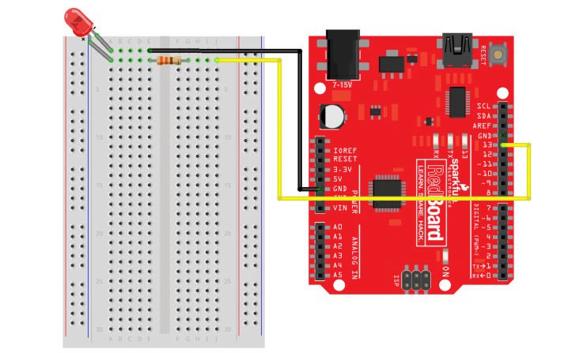

# NotSoBasicArduino
 The follwing files are my second foray into Arduino
 
 
## Table of Contents
* [Table of Contents](#TableOfContents)
* [LED_Fade](#LED_Fade)
* [HelloFunctions](#HelloFunctions)
* [NewPing](#NewPing)
---

## LED_Fade

### Description & Code
Making a LED fade in and out for LED blink revisited assignment

### Code

 pinMode(led, OUTPUT);
}
// the loop routine runs over and over again forever:
void loop() {
 // set the brightness of pin 9:
 analogWrite(led, brightness);
 // change the brightness for next time through the loop:
 brightness = brightness + fadeAmount;
 // reverse the direction of the fading at the ends of the fade:
 if (brightness == 0 || brightness == 255) {
 fadeAmount = -fadeAmount ;
 }
 // wait for 30 milliseconds to see the dimming effect
 delay(30);      

I used the code that was already in the arduino examples and then used the wiring from the sparkfun blink tutorial. 

### Evidence
https://create.arduino.cc/editor/ezell38/cecbf522-9406-4b12-b7ff-cabeef84b5f1

### Images



### Reflection
This assignment was relitivly easy after you learned how to set up the wiring. 

## HelloFunctions

### Description & Code
Description goes here

Here's how you make code look like code:

```C++
#define echoPin 2 // attach pin D2 Arduino to pin Echo of HC-SR04
#define trigPin 3 //attach pin D3 Arduino to pin Trig of HC-SR04
#include <Servo.h>

Servo myservo;

// defines variables
long duration; // variable for the duration of sound wave travel
int distance; // variable for the distance measurement
int pos = 0;
int dis = 0; //this is the current distance

void setup() {
  myservo.attach(9);
  pinMode(trigPin, OUTPUT); // Sets the trigPin as an OUTPUT
  pinMode(echoPin, INPUT); // Sets the echoPin as an INPUT
  Serial.begin(9600); // // Serial Communication is starting with 9600 of baudrate speed
  Serial.println("Ultrasonic Sensor HC-SR04 Test"); // print some text in Serial Monitor
  Serial.println("with Arduino UNO R3");
}

void loop() {
  dis = getdistance();
  if (dis < 20) {
    servo_left();
  }
  else if (dis < 40) {
    servo_right();
  }
  else {
    servo_stop();
  }
}


int getdistance() {
  // Clears the trigPin condition
  digitalWrite(trigPin, LOW);
  delayMicroseconds(2);
  // Sets the trigPin HIGH (ACTIVE) for 10 microseconds
  digitalWrite(trigPin, HIGH);
  delayMicroseconds(10);
  digitalWrite(trigPin, LOW);
  // Reads the echoPin, returns the sound wave travel time in microseconds
  duration = pulseIn(echoPin, HIGH);
  // Calculating the distance
  distance = duration * 0.034 / 2; // Speed of sound wave divided by 2 (go and back)
  // Displays the distance on the Serial Monitor
  Serial.print("Distance: ");
  Serial.print(distance);
  Serial.println(" cm");
  return distance;
}

void servo_left() {
  myservo.write(165);              // tell servo to go to position in variable 'pos'
}


void servo_right() {
  myservo.write(75);              // tell servo to go to position in variable 'pos'
}

void servo_stop() {
  myservo.write(90);
}

```
Talk about how the code works, here....

### Evidence
https://create.arduino.cc/editor/ezell38/ee2733bd-ac8c-49ce-8c87-5278d0f3fe3d

### Images
draw it yourself, take a picture, make a fritzing, whatever you want to EFFECTIVELY communicate how its put together.

### Reflection

## NewPing

### Description & Code
Description goes here

Here's how you make code look like code:

```C++
Code goes here
```
Talk about how the code works, here....

### Evidence
link goes here

### Images
draw it yourself, take a picture, make a fritzing, whatever you want to EFFECTIVELY communicate how its put together.

### Reflection

